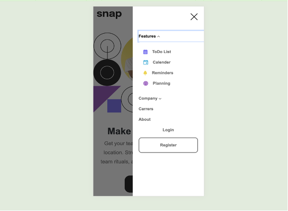
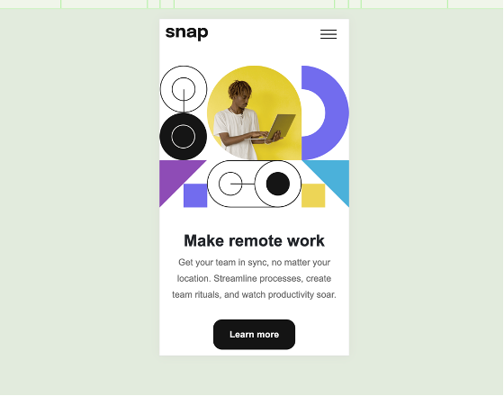
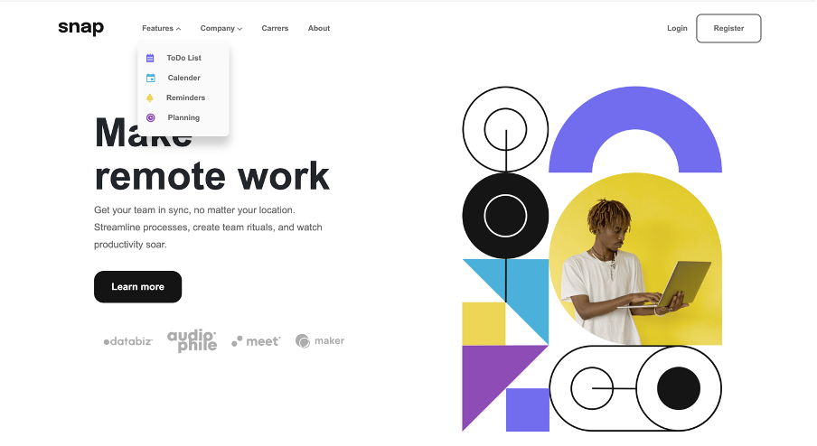

# vml-practical-assessment

This project is one of the front end mentor project which includes dropdown nav bar.

- Live Site URL: [Demo](https://nonoza.github.io/vml-assessment/)

### Screenshot

## Technologies Used

- Semantic HTML5 markup
- SCSS
- Mobile-first workflow
- Bootstrap 5

## Setup Instructions
1. Clone this repo
2. Then cd into to the clone project.
3. Run npm install
4. Then on your terminal run npm run compile:sass to Compile style.scss
5. Add a space and delete and click save so that compile will start.

Thank you

